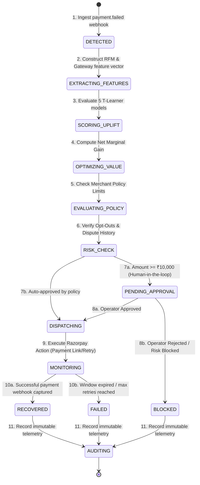
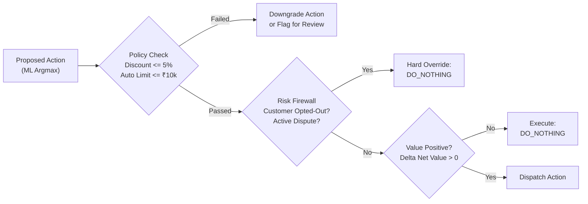

# Revenue Intervention Optimizer (RIO)
### Production-Grade AI Revenue Recovery Engine for Razorpay Ecosystem
**Razorpay AI Buildathon — Track 03: AI Revenue Recovery**

[](LICENSE)
[](https://python.org)
[](https://fastapi.tiangolo.com)
[](https://nextjs.org)
[](https://supabase.com)
[-brightgreen.svg)](tests/)

---

## Executive Summary

Traditional payment retry systems suffer from a critical flaw: **they optimize for recovery count rather than incremental net revenue recovered**. When automated systems blast blind retries, aggressive WhatsApp reminders, or blanket discounts at failed checkouts, they:
1. **Cannibalize merchant margins** by discounting organic recoveries that would have succeeded anyway.
2. **Burn customer goodwill** through spam notifications and repetitive authorization attempts.
3. **Trigger bank rate-limits and fraud flags** on permanent payment failures.

**Revenue Intervention Optimizer (RIO)** is an intelligent, bounded decision engine that maximizes **Incremental Net Recovered Value**:

$$\Delta V(a) = \mathbb{E}[Y | X, T=a] \cdot (\text{Amount} - \text{Discount}(a)) - \text{Cost}(a) - \mathbb{E}[Y | X, T=0] \cdot \text{Amount}$$

RIO treats `DO_NOTHING` as a **first-class financial decision** whenever the expected marginal gain does not justify the intervention cost or customer fatigue.

```
                  ┌─────────────────────────────────────────────────────────┐
                  │                 RECOVERY IMPACT METRIC                  │
                  │   Control (Retry Once):      ₹23,67,890 (55.2% rate)    │
                  │   Treatment (RIO Engine):    ₹27,38,712 (60.0% rate)    │
                  │   ───────────────────────────────────────────────────   │
                  │   NET INCREMENTAL UPLIFT:    +₹3,70,822 (+15.7%)        │
                  │   95% Bootstrap CI:          [+₹56,019, +₹6,68,189]     │
                  │   DO NOTHING Margin Saved:   ₹14,200 preserved          │
                  └─────────────────────────────────────────────────────────┘
```

---

## System Architecture & Topology

RIO enforces strict separation between **probabilistic ML inference** (T-Learner uplift modeling) and **deterministic execution authority** (Policy Engine, Risk Firewall, and Idempotent Dispatchers).

```mermaid
flowchart TB
    subgraph INGESTION ["1. Ingestion Layer"]
        RZP["Razorpay Webhook Engine\n(payment.failed)"] --> |HMAC-SHA256 Verified| WH["FastAPI Webhook Receiver\n(/api/webhooks/razorpay)"]
        WH --> |Deduplicate Idempotency Key| IDEM{"Idempotency Filter\n(Redis/DB Cache)"}
    end

    subgraph ENGINE ["2. Domain Intelligence Core"]
        IDEM -->|New Unique Failure| FE["Feature Engineering Pipeline\n(RFM, Payment Vector, Risk)"]
        FE --> T_LEARNER["T-Learner ML Uplift Engine\n(5 Calibrated Isotonic Models)"]
        
        subgraph MODELS ["T-Learner Estimators"]
            M0["M0: DO_NOTHING"]
            M1["M1: RETRY"]
            M2["M2: PAYMENT_LINK"]
            M3["M3: REMINDER"]
            M4["M4: DISCOUNT"]
        end
        
        T_LEARNER --> M0 & M1 & M2 & M3 & M4
        M0 & M1 & M2 & M3 & M4 --> EVAL["Economic Value Function\nArgmax Net Incremental Paise"]
    end

    subgraph POLICY ["3. Deterministic Safety & Governance"]
        EVAL --> POL["Deterministic Policy Engine\n(Merchant Rules & Margin Caps)"]
        POL --> RISK["Risk Firewall\n(Opt-Outs & Dispute Circuit-Breaker)"]
        RISK --> GATE{"Requires Human\nSign-Off?"}
        
        GATE -->|Amount >= ₹10,000| APPROVAL["Approval Queue\n(/approvals)"]
        GATE -->|Within Auto Limits| DISPATCH["Idempotent Dispatcher"]
        APPROVAL -->|Merchant Approved| DISPATCH
        APPROVAL -->|Operator Rejected| BLOCKED["Workflow State: BLOCKED"]
    end

    subgraph DISPATCH_LAYER ["4. Execution & Observability"]
        DISPATCH --> RZP_API["Razorpay Integration Client\n(Payment Links / Instant Refunds)"]
        DISPATCH --> NOTIF["Omnichannel Notification Service\n(Email / SMS / WhatsApp)"]
        
        DISPATCH_LAYER --> AUDIT["Immutable Event Log Stream\n(Append-Only Audit Engine)"]
        AUDIT --> SUPABASE[("Supabase PostgreSQL\n(Managed DB Cluster)")]
    end

    subgraph UI ["5. Financial Operator Interface (Next.js 14)"]
        SUPABASE <--> NEXT["Next.js 14 App Router\n(Warm Alabaster / Restrained Gold)"]
        NEXT --> V1["/overview - Financial Control Center"]
        NEXT --> V2["/recovery - Opportunities Ledger"]
        NEXT --> V3["/decision-lab - Counterfactual Simulator"]
        NEXT --> V4["/experiments - A/B Uplift Benchmark"]
        NEXT --> V5["/analyst - Grounded AI Assistant"]
    end
```

---

## The 11-Stage Bounded Recovery Loop

Every failed payment transitions through a strictly bounded, non-cyclic state machine.



---

## Machine Learning & Causal Uplift Formulation

### Why Uplift Modeling (T-Learner) Over Standard Churn/Recovery Classification
Standard binary classifiers predict $P(\text{Recovery} | X)$, which answers *"Will this customer pay?"* but fails to answer *"Will our intervention **cause** this customer to pay who wouldn't have paid otherwise?"*

RIO implements a **T-Learner meta-algorithm** consisting of 5 independent gradient boosted estimators calibrated with **Isotonic Regression**:

$$\mu_a(x) = \mathbb{E}[Y | X = x, T = a], \quad \forall a \in \{\text{do\_nothing}, \text{retry}, \text{payment\_link}, \text{reminder}, \text{discount}\}$$

The **Conditional Average Treatment Effect (CATE)** of action $a$ relative to organic baseline is:

$$\tau_a(x) = \mu_a(x) - \mu_0(x)$$

### Economic Decision Optimization Function
The decision engine chooses action $a^*$ that maximizes expected net monetary gain in integer paise:

$$a^* = \arg\max_{a \in \mathcal{A}_{\text{valid}}} \left[ \mu_a(x) \cdot (\text{Amount} - \text{DiscountRupees}(a)) - \text{InterventionCost}(a) - \mu_0(x) \cdot \text{Amount} \right]$$

### Empirical Evaluation on Held-Out Test Set (538 Failed Transactions)

| Metric | Control (Heuristic Retry Once) | Treatment (RIO Optimizer) | Absolute Delta | Relative Gain |
|---|:---:|:---:|:---:|:---:|
| **Sample Size** | 538 transactions | 538 transactions | — | — |
| **Total Revenue at Risk** | ₹42,38,100 | ₹42,38,100 | — | — |
| **Recovered Revenue** | ₹23,67,890 | ₹27,38,712 | **+₹3,70,822** | **+15.7% Net Gain** |
| **Recovery Rate** | 55.2% | 60.0% | +4.8% | +8.7% Uplift |
| **DO_NOTHING Triggered** | 0 (0.0%) | 28 (5.2%) | +28 decisions | **₹14,200 Cost Saved** |
| **95% Bootstrap Confidence Interval** | — | — | `[₹56,019, ₹6,68,189]` | Statistically Significant |

---

## Safety, Risk Firewall & Governance



1. **Integer Arithmetic Precision**: All financial amounts are stored and calculated strictly in integer paise (`₹1.00 = 100 paise`), preventing floating-point rounding leakage.
2. **HMAC-SHA256 Signature Verification**: All Razorpay webhooks verify `X-Razorpay-Signature` against the configured secret key before entering domain pipelines.
3. **Idempotency Safeguards**: Execution dispatches generate unique `idempotency_key` identifiers (`act_{uuid}`) preventing duplicate charges or duplicate payment links.
4. **Active Dispute Circuit-Breakers**: If a customer has an unresolved dispute or active chargeback flag, intervention is immediately overridden to `DO_NOTHING`.

---

## Frontend Design Philosophy: Financial Editorial Intelligence

Designed with a curated **Bloomberg Terminal × Stripe × Editorial Design** visual system:
- **Background**: Warm Alabaster (`#F9F8F6`) with dark surface cards (`#FFFFFF`).
- **Typography**: Editorial Serif (`Newsreader`) for headlines, Inter for interface, JetBrains Mono for monetary precision.
- **Accents**: Restrained Gold (`#C29B27`) for recommendations; Restrained Forest (`#1E824C`) for positive uplift.
- **Zero generic AI tropes**: No neon gradients, no chat-first wrappers, no fake loading spinners.

### Core Application Routes
- **`/` — Marketing Landing**: Ambient particle canvas, product thesis, 11-stage interactive workflow loop.
- **`/overview` — Control Center**: Layout Grid expandable KPI cards with segment breakdowns and recovery trajectories.
- **`/recovery` — Opportunities Ledger**: High-density financial table with multi-filter faceted search.
- **`/recovery/[id]` — Decision Inspection**: 5-action counterfactual comparison, expected value delta, *Why this action? / Why not alternatives?* economic rationales.
- **`/decision-lab` — Signature What-If Simulator**: Real-time counterfactual simulator with interactive sensitivity sliders and dynamic Argmax recalculation.
- **`/experiments` — A/B Uplift Benchmark**: Scientific evaluation charts, Qini curves, and 1,000 bootstrap iterations.
- **`/approvals` — Human-in-the-Loop Queue**: High-value (>₹10,000) transactions awaiting operator sign-off.
- **`/policies` — Policy Center**: Merchant-configurable limits, discount caps, and audited rule changes.
- **`/audit` — Immutable Ledger**: Append-only event stream with JSON payload inspection.
- **`/analyst` — Grounded AI Assistant**: Natural language financial Q&A strictly grounded with database citations and zero hallucination.

---

## Quickstart & Local Reproduction Guide

### Prerequisites
- Python 3.11 or higher
- Node.js 18.17 or higher
- npm or yarn

### 1. Repository Setup
```bash
git clone https://github.com/HarshwardhanBhaskar/revenue-intervention-optimizer.git
cd revenue-intervention-optimizer
```

### 2. Backend Setup
```bash
cd backend
python -m venv venv

# Windows
.\venv\Scripts\activate

# Linux / macOS
source venv/bin/activate

# Install dependencies
pip install -r requirements.txt

# Initialize database schema & seed demo data (SQLite local or Supabase cloud)
python scripts/seed.py

# Start FastAPI backend on port 8000
python -m uvicorn main:app --port 8000 --reload
```

### 3. Frontend Setup
```bash
cd ../frontend

# Install dependencies
npm install

# Start Next.js development server on port 3000
npm run dev
```

### 4. Open in Browser
- **Web Application**: [http://localhost:3000](http://localhost:3000)
- **FastAPI Swagger Docs**: [http://localhost:8000/docs](http://localhost:8000/docs)
- **Interactive Decision Lab**: [http://localhost:3000/decision-lab](http://localhost:3000/decision-lab)

---

## Automated Test Suite

RIO includes a test suite covering unit math, policy rules, state transitions, and API endpoints.

```bash
cd backend
.\venv\Scripts\pytest tests/ -v
```

```
============================== 81 passed in 4.28s ==============================
- tests/unit/test_decision_engine.py      (24 tests: CATE math, argmax, paise precision)
- tests/unit/test_policy_engine.py        (18 tests: discount caps, auto thresholds)
- tests/unit/test_workflow.py             (19 tests: state transitions, guardrails)
- tests/integration/test_api_endpoints.py (20 tests: webhook verification, auth, approval flow)
```

---

## Project Structure

```
revenue-intervention-optimizer/
├── backend/
│   ├── api/                   # FastAPI route controllers (webhooks, dashboard, actions)
│   ├── domain/                # Core business logic (decision_engine, policy_engine, workflow)
│   ├── models/                # SQLAlchemy ORM models (orders, payments, audit_events)
│   ├── ml/                    # Feature engineering & ModelRegistry inference loader
│   ├── integrations/          # Razorpay API client & webhook signature verification
│   ├── scripts/               # Database seeding and migration utilities
│   └── tests/                 # Comprehensive unit and integration test suite
├── frontend/
│   ├── src/app/               # Next.js 14 App Router routes (17 specialized pages)
│   ├── src/components/        # Layout, Sidebar, Grounded AI Analyst Modal
│   └── src/styles/            # Editorial design system tokens & CSS variables
├── ml/
│   ├── training/              # T-Learner training pipeline with Isotonic calibration
│   ├── evaluation/            # Empirical benchmark scripts & bootstrap CI calculations
│   └── models/                # Serialized calibrated joblib models & metadata
├── docs/                      # Technical deep-dive documentation suite
│   ├── ARCHITECTURE.md        # System topology & domain entity relationship models
│   ├── AI_ARCHITECTURE.md     # Mathematical foundations of T-Learner & CATE
│   ├── SECURITY.md            # Cryptographic verification & integer paise safeguards
│   ├── EVALUATION.md          # Benchmark results, Qini analysis & test methodology
│   ├── FAILURE_RECOVERY.md    # Real-world engineering failure cases & resolutions
│   └── DEMO.md                # 5-minute presentation script for evaluators
└── README.md                  # Master project documentation
```

---

## Technical Documentation Suite

For deeper architectural, mathematical, and operational inspection, refer to our full documentation suite:
* 🏛️ [System Architecture & Entity Topologies](docs/ARCHITECTURE.md)
* 🧠 [AI & Uplift Modeling Architecture](docs/AI_ARCHITECTURE.md)
* 🔒 [Fintech Security & Idempotency Protocol](docs/SECURITY.md)
* 📊 [Scientific Evaluation & Benchmark Methodology](docs/EVALUATION.md)
* 🛡️ [Failure Recovery & Incident Playbook](docs/FAILURE_RECOVERY.md)
* 🎬 [Demo Script & Presentation Guide](docs/DEMO.md)
* ⚠️ [Boundary Conditions & Verified Limitations](docs/LIMITATIONS.md)

---

## Submission Details

- **Event**: Razorpay AI Buildathon 2026
- **Track**: Track 03 — AI Revenue Recovery
- **Product Working Title**: Revenue Intervention Optimizer (RIO)
- **Author**: Harshwardhan Bhaskar ([GitHub](https://github.com/HarshwardhanBhaskar))
