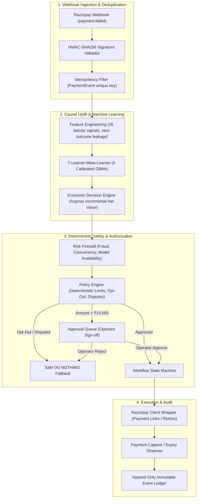
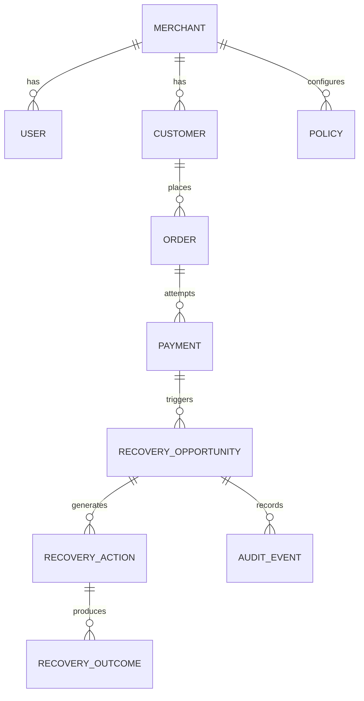

# System Architecture — Revenue Intervention Optimizer (RIO)

## 1. System Overview

RIO is a production-grade fintech intelligence engine designed to maximize **incremental net revenue** from payment failures rather than raw intervention volume. It implements an explicit, bounded 11-stage loop:

```
DETECT → UNDERSTAND → PREDICT → SIMULATE → DECIDE → POLICY CHECK → HUMAN APPROVAL IF REQUIRED → EXECUTE → OBSERVE → MEASURE → LEARN
```

---

## 2. Component Topology



---

## 3. Database Schema Design (PostgreSQL / SQLite)

The database schema guarantees strict referential integrity and prevents floating-point monetary discrepancies by using **integer paise** across all financial fields.



---

## 4. Separation of Concerns & Authority Hierarchy

| Component | Responsibility | Authority Level | Technology |
|---|---|---|---|
| **T-Learner ML Models** | Estimate conditional recovery probabilities per action: $P(\text{Recovery} \mid X, a)$ | Advisory Only | Scikit-Learn `CalibratedClassifierCV` |
| **Economic Decision Engine** | Calculate net values and rank actions: $\text{Argmax} [\mathbb{E}[\text{Net} \mid a] - \mathbb{E}[\text{Net} \mid \text{do-nothing}]]$ | Recommendation | Python Domain Service |
| **Risk Firewall** | Pre-policy circuit breaker (fraud, missing models, race guards) | Deterministic Hard Gate | Python Domain Service |
| **Policy Engine** | Business rules enforcement (₹10k threshold, 5% max discount, opt-out, disputes) | Deterministic Authoritative | Python Domain Service |
| **State Machine** | Validates legal transitions (`DETECTED` $\to$ `ANALYZING` $\to \dots \to$ `RECOVERED`) | State Authority | Python Enum & Guard Rules |
| **Audit Engine** | Event-sourced append-only ledger | Immutable Record | Async SQLAlchemy Event Log |
| **Next.js Web UI** | Presentation and operator interaction | Read-only / Untrusted | Next.js 14 App Router |
